**Learning Objective**

To introduce raster data, including elevation and land cover data sets.
To introduce raster data manipulation, including mosaic, mask, and 
projection. To introduce raster analysis, including terrain
visualization and analysis, as well as map algebra. As a demonstration,
you will work with elevation and land cover data for Delaware County,
Pennsylvania.

First, complete the tutorial by following the steps below. Then, using
the skills you’ve learned in the tutorial, complete the assignment given
following the tutorial.

# TUTORIAL

## Acquiring the Data

We will work with elevation and land cover data, as well as municipal
boundary data, for Delaware County, Pennsylvania.

**First, acquire the municipalities data.**

From [PASDA](http://www.pasda.psu.edu/), use the search function to find
and download the following file:

  - Pennsylvania municipality boundaries (2020)

**Next, acquire the elevation data.**

We will download raster elevation data from [The National
Map](https://www.usgs.gov/core-science-systems/national-geospatial-program/national-map) (<https://www.usgs.gov/core-science-systems/national-geospatial-program/national-map>), the US
federal data geoportal administered by the US Geological Survey (USGS).

THE INTERFACE IS A LITTLE BIT DIFFERENT NOW SO IF YOU CAN'T FOLLOW IT DONWLOAD FROM HERE

[USGS_1_n40w076.tif and USGS_1_n41w076.tif](https://tuprd-my.sharepoint.com/:f:/g/personal/jmennis_temple_edu/EkDUbTwFk_9LgZV4BIG_Ts4BJabWs9M56GpyU_6LgOZtGw?e=scjT6V) (<https://tuprd-my.sharepoint.com/:f:/g/personal/jmennis_temple_edu/EkDUbTwFk_9LgZV4BIG_Ts4BJabWs9M56GpyU_6LgOZtGw?e=scjT6V>)

1.  > Go to The National Map, and click on The National Map Viewer.
    > Then, click on **Data Download** to load the downloadable map
    > viewer.

2.  > On the left side of the window, on the **Datasets** tab under **Data** click on **Elevation
    > Products (3DEP)** and then check the box for **1 arc-second DEM**.
    > Uncheck the other boxes.

3.  > In the Search location text bar type in 'Delaware County,
    > Pennsylvania' and zoom to Delaware County.

4.  > In the pop up box for Delaware County click on the **Find Products**
    > link.

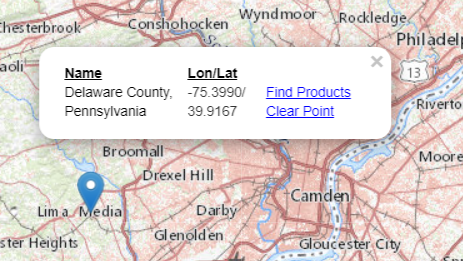

5.  > On the left side of the window click on **Download** to download the
    > DEM in a tif format (54.7 MB).
    

> **Because the DEM data do not adhere to county boundaries, we will
> need to download an additional DEM data set to cover the entirety of
> Delaware County.**

6.  > Repeat the steps above, but search for and download the 1
    > arc-second DEM for Montgomery County, Pennsylvania.

These steps should yield two zip files:

  - USGS_1_n40w076.tif

  - USGS_1_n41w076.tif

**Next, acquire the land cover data.**

We will acquire the land cover data from the the [Multi-Resolution Land Characteristics Consortium](https://www.mrlc.gov/viewer/) (<https://www.mrlc.gov/viewer/>).

1.  Go to the MRLC viewer, and in the **Dataset** tree, make sure only **2016 CONUS Land Cover** is checked. Uncheck all other boxes.

2.  On the map, click the **Open Data Download Tool** button.  This will open a side panel that will help you select the area from which you will download data.

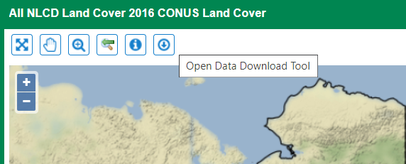

3. Zoom in on the map to southeastern Pennsylvania.  Draw a box that completely contains our study area by right-clicking to place one corner of the box, and then right-clicking again to place the second.  

4. On the panel on the right-hand side, check the **Land Cover** box, and then check the **2016 Land Cover ONLY** button.

5. Enter your email address and click **Download**.  The link to the file download will be sent to your email. Download and unzip the NLCD file in your workspace folder.

You should now have 4 data
files in your workspace folder (2 elevation grids, land cover, and municipalities).

## Explore the Data 

Open ArcGIS Pro and explore each of the downloaded data sets in the catalog view. Note that
raster data are symbolized in the catalog tree using a grid symbol .

View the land cover raster (with .tiff file extention). Zoom in so you can
see individual grid cells.

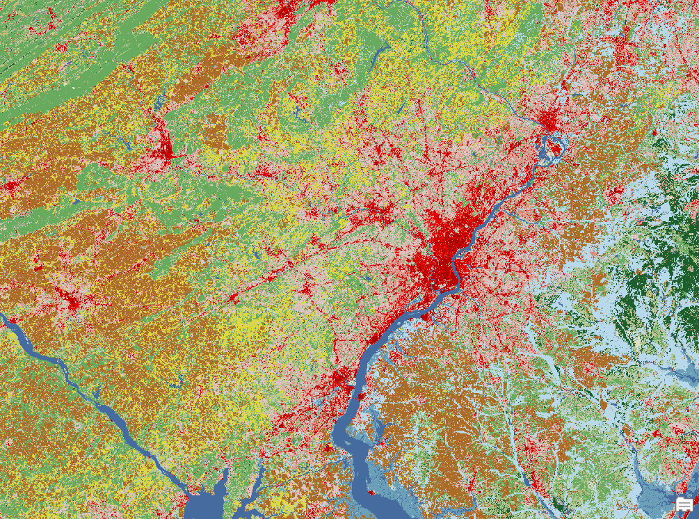

Now view the land cover attribute table. The `VALUE` field in the table,
and the different colors in the image, correspond to different land
cover categories, which are described on NLCD web page:
<https://www.mrlc.gov/data/legends/national-land-cover-database-2016-nlcd2016-legend>.

View each of the elevation grids. Note that there are no attribute
tables because the grids are a floating point data type (i.e. continuous
data). The value of each grid cell is the altitude in meters above mean
sea level.

## Mosaic the Elevation Data

Open a new map and add the two elevation grids. They should appear adjacent
to each other.

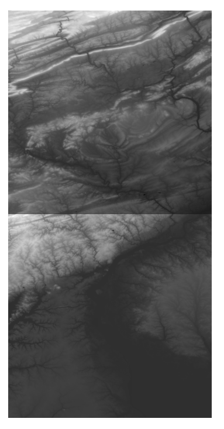

Here we will use the mosaic operation to merge the two grids into a
single grid.

1.  > Open the **Toolbox** and go to **Data Management Tools→Raster→Raster
    > Dataset→Mosaic to New Raster**.

2.  > In the **Mosaic to New Raster** Geoprocessing pane, for **Input Rasters** choose
    > the two elevation grids.  For **Output Location** select your Lab7 workspace folder. For **Raster Dataset Name with Extension** enter
    > 'elev_mo'. For Number of Bands enter 1. Click Run.

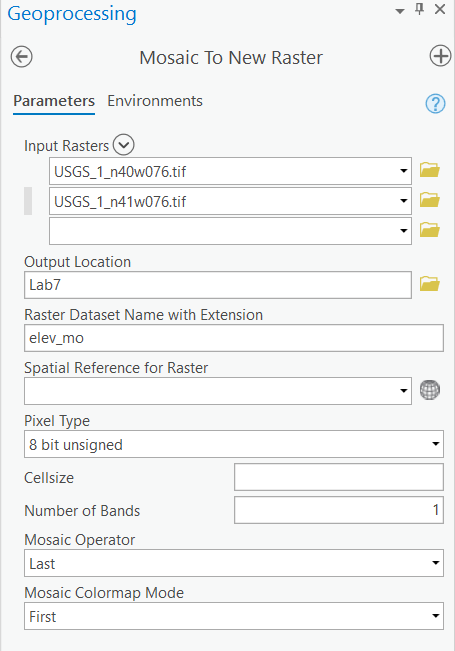

3.  > View the new grid. It should appear as the two original grids
    > merged together.

4.  > Remove the two original elevation grids, leaving the `elev_mo`
    > grid.

## Mask the Raster Data to Delaware County

Here, we will extract the elevation data for Delaware County.

1.  > Add the municipalities layer to the map with the elevation mosaic
    > grid.

2.  > Use a **Select by Attribute** operation to select Delaware County
    > municipalities from the municipalities data. In the attribute
    > table, the County field value=23 is Delaware County.

3.  > Export the Delaware County municipalities to its own shapefile
    > named 'del_cnty'.

4.  > Remove the original municipalities layer from the map.

5.  > Open the **Toolbox** and go to **Spatial Analyst Tools→Extraction→Extract by Mask**.

6.  > In the **Extract by Mask** tool, for **Input raster** choose the elevation
    > mosaic grid and for **Input raster or feature mask data** choose
    > `del_cnty`. Name the output raster 'del_elev'.

7.  > Turn off all the layers except `del_elev` and view the new raster.

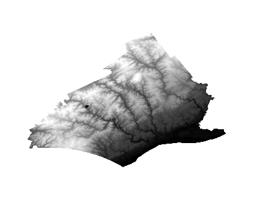

**Now, we will mask the land cover data to Delaware County, but we will
need to open a new map because the land cover grid is in a
different CRS.**

1.  > Insert a new map in your project and close the old one. 

2.  > Add the land cover grid with the .tiff file extension.

3.  > Add the `del_cnty` layer.

4.  > Repeat the steps above to mask the land cover data to Delaware
    > County. Call the output raster 'del_land'.

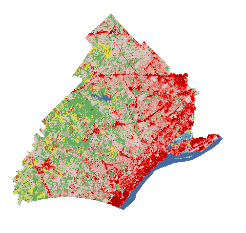

5.  > Close the map.

## Reproject the Data

View the `del_elev` and `del_land` grids in the catalog view. They are clearly
different shapes because they are in different CRSs, as you can confirm
by going to the **Layer Properties** of each. Here, we will reproject all
three data sets (the `del_elev` and `del_land` grids, and the `del_cnty`
shapefile) into UTM.

1.  > While still in the catalog view, reproject the `del_cnty` shapefile into
    > `NAD 1983 UTM Zone 18N`. Name the new shapefile 'del_cnty_utm'.

2.  > Reprojection for raster data uses a different tool. Open the **Toolbox** and go to 
    > **Data Management Tools→Projections and
    > Transformations→Raster→Project Raster**.

3.  > The tool pane is similar to the vector **Project** tool. Convert
    > both the `del_elev` and the `del_land` rasters to
    > `NAD 1983 UTM Zone 18N`. Name the new grids 'del_elev_utm' and
    > 'del_land_utm', respectively.

## Creating a Hillshade

A hillshade is a grid that encodes a hypothetical reflectance value off
an elevation surface given the position of a virtual light source. It
allows for the visual representation of the terrain as though you were
viewing the surface from an airplane.

1.  > Open a new map and add the `del_elev_utm` grid.

2.  > To create a hillshade grid, open the **Toolbox** and go to **Spatial Analyst
    > Tools→Surface→Hillshade**. For Input raster choose `del_elev_utm`.
    > Name the output 'hill_1'. Leave the other defaults and click Run.

3.  > In the resulting hillshade you should be able to see the more
    > rugged terrain in the north and west of the county and the stream
    > valleys which flow south towards the Delaware River.

 
4.  > You can also exaggerate the vertical height to improve the
    > visualization of the terrain. Perform another hillshade but this
    > time change the Z factor to 2 or 3. Experiment with other
    > parameter changes in the hillshade, including the virtual location
    > of the light source by tweaking Altitude and Azimuth settings.
    > Examine the effects of changing parameters on the resulting
    > hillshade layer.

## Visualizing Terrain

Impressive visualizations of terrain can be easily generated by using
the elevation and hillshade grids together. Turn off everything except
the elevation and your preferred hillshade grids from your experiments
in the last section, and order your layers so that the hillshade is 'on
top'.

1.  > Open the **Symbology** for the elevation grid. (Notice how it differs slightly from the **Symbology**
    > for vector layers that we have been working with in previous
    > lab exercises.) Choose a multi-color color ramp like the one shown
    > here:

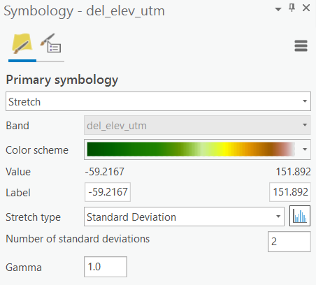 

2.  > Now click on the hillshade grid and go to
    > the contextual **Appearance** tab. Change the transparency to 30%. 
    

    
     Your display should now look something like
    > this:

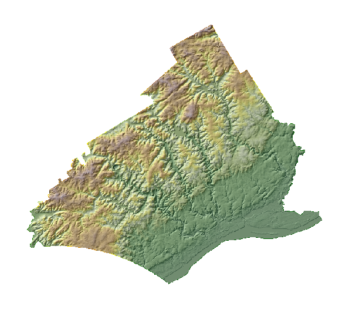 

3.  > You can also add land use to further enhance the visualization.
    > Add the `del_land_utm` grid to the map and move it between the
    > hillshade and elevation grids in the **Contents**. Experiment with
    > different transparency settings for the land use and hillshade
    > grids so that both can be seen simlutaneously. (Start with land
    > use transparency=40% and hillshade transparency=50%).

4.  > Now try displaying only the developed area in the land use grid to
    > show where the cities are in relation to the elevation
    > information. You can change this setting in the **Symbology** for
    > the land use layer. Select all the land cover
    > categories except for the Developed, High Intensity land covers
    > and right-click and select **Remove**. You may want to adjust the color setting, or the
    > transparency setting on the **Display** tab to make it less
    > transparent (say, 20%). 

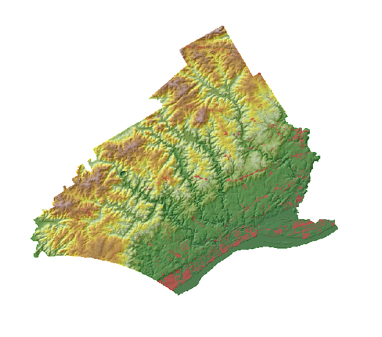

## Calculating Slope

The slope operation allows you to derive slope from elevation. Slope is
calculated as rise over run, or the gradient of change in elevation, and
can be measured in degrees or percent.

1.  > Turn off the layers except for `del_elev_utm`.

2.  > Open the **Toolbox** and go to **Spatial Analyst Tools→Surface→Slope**. For **Input
    > raster** choose `del_elev_utm`. Name you grid 'slope'. Leave the
    > **Output measurement** as the default (degree). Press Run.

3.  > Examine the resulting slope grid. Note that the steepest slopes
    > occur along the streams.

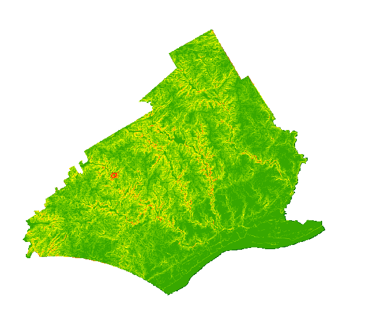

## Summarizing Grid Data using a Zonal Function

A zonal function allows you to summarize the values of raster grid cells
in zones specified in a second file. The zone file can be a raster or
vector format. As an example we will summarize the slope by land use
category in Delaware County.

1.  > Turn off all the layers but the slope and land use grids.

2.  > In the **Toolbox**, go to **Spatial Analyst Tools→Zonal→Zonal Statistics as
    > Table**. For **Input raster or feature zone data** choose
    > `del_land_utm`. The **Zone field** should default to `VALUE`, since this
    > is the only data associated with this raster. For **Input value**
    > raster choose the slope grid. Name the output 'lu_slope'. Press Run.

3.  > Open the resulting table. The zonal function
    > generates a table in which each record is a zone (here, land use)
    > and the fields contain information on various aggregate functions
    > such as the minimum, maximum, range, mean, standard deviation, and
    > sum (which is not applicable here) of the values (here, slope) for
    > each zone. For example, the `MEAN` field reports the mean slope
    > value for each land use category. The mean slope for Developed,
    > High Intensity land (Value=24) is 1.56°, whereas for Deciduous
    > Forest land (Value=41) the mean slope is 6.52°.

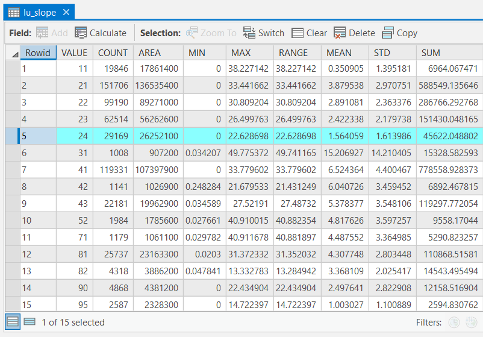

4.  > The `COUNT` field is the number of grid cells in that zone (here,
    > land use) and the `AREA` field is the area. For instance, the number
    > of grid cells in the Developed, High Intensity category in
    > Delaware County is 29,169, and the total area of Developed, High
    > Intensity land is 26,252,10 square meters (since the data are in
    > the UTM CRS, which uses meters as units).

It is also possible to use a vector data layer as the zone layer in a
zonal function. Here, we will summarize the slope by municipality in
Delaware County.

1.  > Add the `del_cnty_utm` layer to the map. Repeat the **Zonal
    > Statistics as Table** function. For **Input raster or feature zone
    > data** choose `del_cnty_utm`. For **Zone field**, choose `MUNICIPAL_`, as
    > this is the code for each municipality (we want an output table
    > where each record represents a unique municipality). For **Input
    > value raster** choose the slope grid. Name the output 'mun_slope'.
    > Press Run.

2.  > View the output table. It should have 49 records – one for each
    > municipality.

Let’s visualize the results by creating a choropleth map of the mean
slope by municipality.

1.  > Join the `mun_slope` table to the `del_cnty_utm` attribute table
    > using the `MUNICIPAL_` field to facilitate the join.

2.  > Create a choropleth map of the `MEAN` field (i.e. the mean slope of
    > each municipality). Use a quantile classification and choose a
    > sequential color scheme. You can see that the municipalities with
    > the average steepest slopes occur in the central and western part
    > of the county.

# ASSIGNMENT

## Objective

Flooding in Delaware County is a problem, particularly in the
southeastern portion where several streams flow into the Delaware River.
Flooding is made worse by steep slopes and the presence of impervious
surface cover (i.e. developed land cover surfaces which do not allow
water to infiltrate, such as pavement and rooftops), both of which
contribute to rapid, high volumes of runoff during storm events.

The objective is to identify municipalities that might be key
contributors to flooding in Delaware County. Specifically, answer the
following questions:

Which municipalities in Delaware County, Pennsylvania have a *median*
percent impervious surface area of at least 50%?

Which municipalities in Delaware County, Pennsylvania have a *mean*
percent slope of at least 5 degrees?

## Deliverables

**Turn in a report in the format described in the syllabus.**

Be sure to include the following information:

1.  A list of the municipalities which have a median percent impervious
    surface area of at least 50%.

2.  A list of the municipalities which have a mean percent slope of at
    least 5 degrees.

3.  A map of the terrain that simultaneously shows the hillshade and
    elevation with the grid cells with a percent impervious surface
    \> 50% overlain.

4.  A choropleth map of the median percent impervious surface by
    municipality.

The **Introduction** section should state the research objective and the
relevant criteria for identifying the municipalities.

The **Data and Methods** section should state the data sets used in the
analysis, from where those data were acquired, and the GIS operations
employed.

The **Results** section should state the results (i.e. the lists of the
municipalities that meet each of the criteria). The maps should be cited
in the text here.

The **Discussion** section should state an interpretation of the results
(i.e. what parts of the county have steeps slopes or high impervious
surface percentages), limitations of the analysis, and how the analysis
could be improved or expanded.

The **Tables** **and Figures** section should contain the maps, each on
a separate page with a caption. The maps should be cited in the text.

## Getting Started

You can use some of the products you have created in the tutorial for
the assignment. You will also need to download a new raster data set on
impervious surface.

1.  Download the 2016 NLCD Impervious Surface data from the MRLC viewer
    (you can follow the same directions you used to download the land
    cover data, above, but instead of the land cover data download the
    2016 CONUS Impervious Surface data for the study area).
    The value of each grid cell in the impervious surface grid is the
    percentage of the grid cell covered by impervious surface. Mask the
    impervious surface data to Delaware County, and convert it to the
    UTM CRS.

2.  Use the elevation grid and the hillshade grid you created, in
    combination with the impervious surface grid, to generate a map of
    the terrain that simultaneously shows the hillshade and elevation
    with the percent impervious surface layer overlain.

3.  Use the output table from the **Zonal Statistics as Table** function you
    completed in the tutorial using the municipalities (zone layer) and
    the slope grid (value grid) to identify the municipalities which
    have a mean percent slope of at least 5 degrees.

4.  Use a **Zonal Statistics as Table** function using the municipalities
    layer (as the zone layer) and the impervious surface grid (as the
    value grid) to generate a table from which you can identify the
    municipalities which have a median percent impervious surface area
    of at least 50%.

5.  Join the output table from the previous **Zonal Statistics as Table**
    function to the municipalities attribute table to generate a
    choropleth map of the median percent impervious surface by
    municipality.
